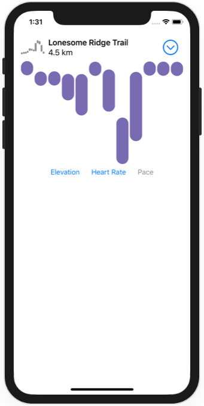

# Animating views and transitions

https://developer.apple.com/tutorials/swiftui/animating-views-and-transitions

## Adjustments
- Prevent title clipping
- Adjust spacing to avoid elements overriding each other

## Screenshots

