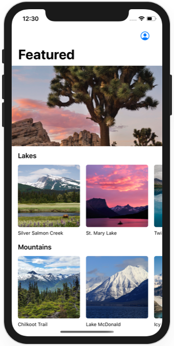
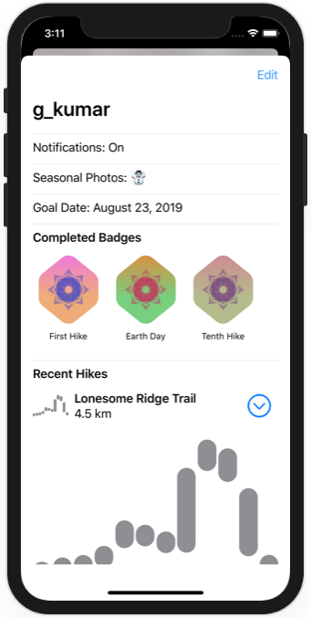
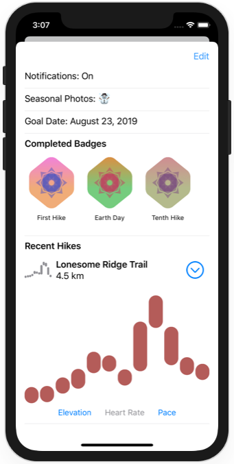
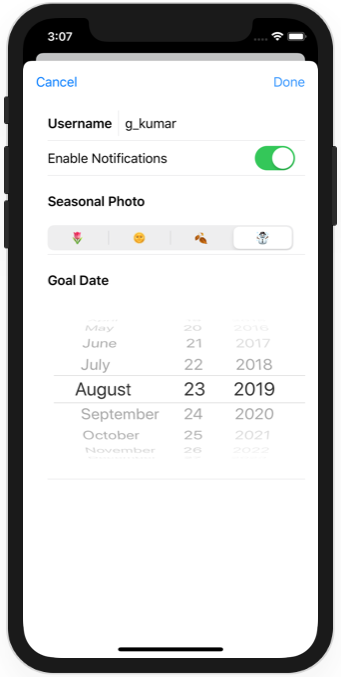

# Working with UI controls

https://developer.apple.com/tutorials/swiftui/working-with-ui-controls

## Adjustments
- Replace double "Done" button by "Cancel" and "Done" buttons and correct behaviour
- Work around to make HikeView functional

## Screenshots

