# SwiftUI Tutorials

Source code for Apple SwiftUI tutorials.

https://developer.apple.com/tutorials/swiftui/

These projects require XCode 11 or above.

## Preview

*Within each project are larger versions of the screenshots.*

### SwiftUI Essentials

Projects | Screenshots
---      | ---
[Creating and combining views](01-SwiftUIEssentials/01-CreatingAndCombiningViews) | 
[Building lists and navigation](01-SwiftUIEssentials/02-BuildingListsAndNavigation) |  
[Handling user input](01-SwiftUIEssentials/03-HandlingUserInput) |   

### Drawing and Animation

Projects | Screenshots
---      | ---
[Drawing paths and shapes](02-DrawingAndAnimation/01-DrawingPathsAndShapes) | 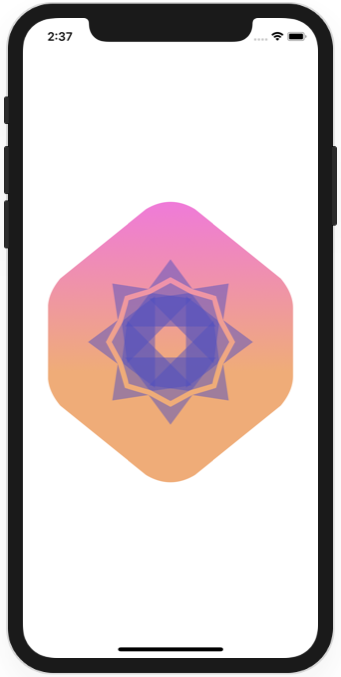
[Animating views and transitions](02-DrawingAndAnimation/02-AnimatingViewsAndTransitions) |    

### App design and layout

Projects | Screenshots
---      | ---
[Composing complex interfaces](03-AppDesignAndLayout/01-ComposingComplexInterfaces) | 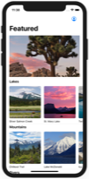 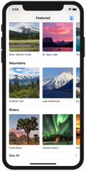 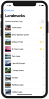 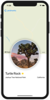
[Working with UI controls](03-AppDesignAndLayout/02-WorkingWithUIControls) | 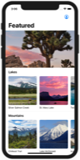 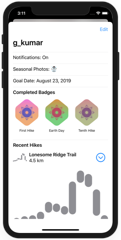 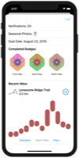 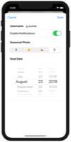

### Framework integration

Projects | Screenshots
---      | ---
[Interfacing with UIKit](04-FrameworkIntegration/01-InterfacingWithUIKit) | 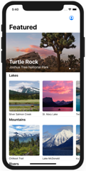 
[Creating a WatchOS App](04-FrameworkIntegration/02-CreatingAWatchOSApp) | 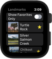 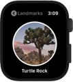 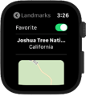 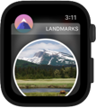 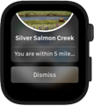
[Creating a MacOS App](04-FrameworkIntegration/03-CreatingAMacOSApp) | 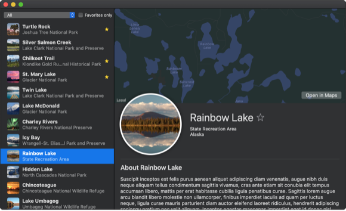
