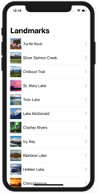

# SwiftUI Tutorials

Source code for Apple SwiftUI tutorials.

https://developer.apple.com/tutorials/swiftui/

These projects require XCode 11 or above.

## Preview

*Within each project are larger versions of the screenshots.*

### SwiftUI Essentials

Projects | Screenshots
---      | ---
[Creating and combining views](01-SwiftUIEssentials/01-CreatingAndCombiningViews) | 
[Building lists and navigation](01-SwiftUIEssentials/02-BuildingListsAndNavigation) |  

